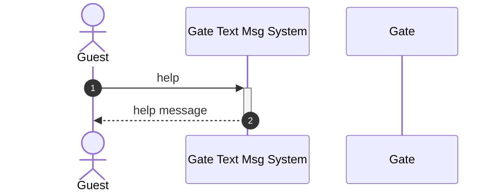
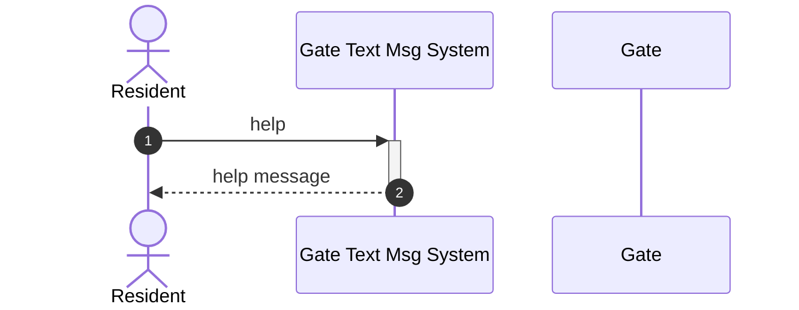
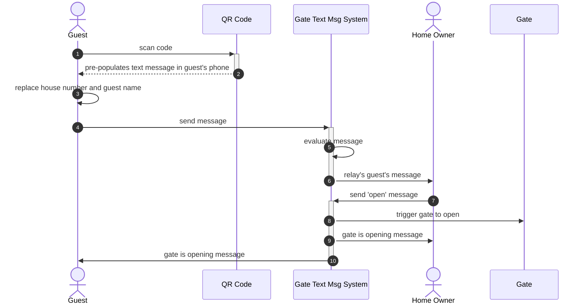
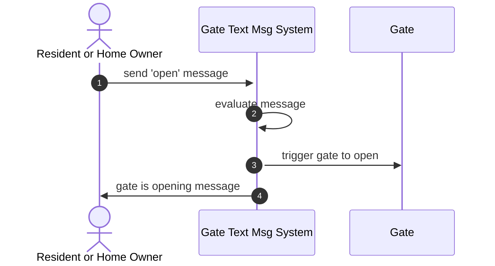

# Whispering Pines Gate - User's Guide

## <a name="systemoverview">System Overview</a>
The Whispering Pines Trail gate has been in place for many years with several methods by which the gate might be opened.
1. Entering a code into the key pad outside the gate
2. Pressing a button on a remote/key fob (similar to opening a garage door)
3. Driving near a sensor embedded in the ground on the east side of the road between the gate and mailboxes
4. Pressing the `exit` button, located on the camera post between the gate and mailboxes

In addition to these methods, another method of open the gate has been added, which allows both guests and residents to interact with the gate via text messages using their cell phones.

## <a name="Help">System Help</a>
At any time, any user may send a message to the gate text message system requesting a summary of the commands that user may use to interact with the system.  To do this, the user must simply send a tedt message with the word `help`, and the system will determine the user's capabilities within the system and respond accordlingly.

### Guest example - help response


```
Send a message like the provided example, be sure the house number for the property to which you are visiting is at the beginning of the message.

Example: '3021 This is George, please open the gate'
```

### Resident example - help response


```
The following options are available:

- 'help' to see this message
- 'open' to open the gate
```

### Owner example - help response


```
The following options are available:

- 'help' to see this message
- 'open' to open the gate
- 'access list' to see the access configuration for your property
- 'history' to see the usage history for your property
- 'add << tn >> << role (optional) >>' adds a TN to access property (example: add 4048675309).  The role of RESIDENT is the default
- 'remove << tn >>' removes a TN from the system (example: remove 4048675309)
```

## <a name="Guests">Guests</a>
Guests are any individual for which that individual's cell phone number is not recognized by the gate text message system.  

Upon arrival of a guest at the gate, the guest has the options of entering a code into the keypad, waiting for another gate user to open the gate, or send a message to the gate text message system, which will relay that message to a homeowner within the community.  

Assuming the guest elects to send a text message, the message sent by the guest must be in the format of "<< house number >> << message >>".  For example: "3021 This is George from Amazon, please open the gate."  

To help facilitate guests in creating messages in this format, a QR code and a brief message located near the keypad will be provided to assist the guest.

Upon the guest sending their message, the text message system will check the message's validity, and relay the "<< message >>" portion of the guest's message to the home owner(s) at the address denoted by the "<< house number >>" portion of the guest's message.  

For example: "3021 This is George from Amazon, please open the gate." will send the message "This is George from Amazon, please open the gate. (sent from 4048675309)" to all homeowners of the property located at 3021.  If no property exists at 3021, then the guest will receive a response indicating that their message was incorrect.

### Example Guest Scenario - requesting the gate be opened

1. Guest arrives at the gate and scans the QR code using their cell phone.
2. The QR code pre-populates a text message in the guest's phone with the gate's text message system's phone number and the message "<< house number >> This is << guest name >>, please open the gate."
3. The guest replaces the << house number >> and << guest name >> portions of the message with whatever information is relevant to their visit.
4. Guest sends the message
5. The gate text message system receives and analyzes the message.  
6. If the message is valid, the system then forwards the message to the home owner(s) of the property specified
7. The home owner(s) responds to the request by sending an "open" text message back to the system.
8. The gate is opened
9. A message is sent to the owner that the gate is opening
10. A message is sent to the guest that the gate is opening and the guest is allowed entry into the community.

## <a name="residents">Residents</a>
Residents are any individuals for which that individual's cell phone number is recognized by the gate text message system.  There are 3 levels of access privilege within the Resident categorization of users.
1. Resident
2. Owner
3. Admin

### Example Resident (or Home Owner) Scenario - opening the gate

1. Resident arrives at the gate, and sends an "open" message
2. The gate text message system receives and analyzes the message.
3. The gate is opened
4. A response text message is sent back to the requestor indicating the gate is being opened.

## <a name="owners">Owners</a>
Home owners have additional features available to them to be able to self-administer access to their property.  These features include:
* adding users for accessing their property
* removing users from accessing their property
* viewing their property access configuration
* viewing the access history for their property

### Example Home Owner Scenario - adding a user
TBD

### Example Home Owner Scenario - removing a user
TBD

### Example Home Owner Scenario - view property access configuration
TBD

### Example Home Owner Scenario - view access history
TBD

## <a name="administrators">Administrators</a>
Administrators have all the same abilities as home owners, plus the ability to administer property setup on-behalf of other home owners.  A separate `Administrators Guide` is available for system administrators.

## <a name="history">History Note</a>
Interaction history is maintained for up to 1 month in the gate text message system's datastore.  After 1 month, the history data is archived, and can only be accessed upon request to a gate administrator.

## <a name="roles">Roles</a>
There are several roles used by the gate text message system.  These roles are used to allow certain users access to system functions applicable to their role within the community.  These roles include:

* Guest - Any user not recognized by the system
* Resident - A user with limited access to the gate text messaging system.  Typically family members of homeowners within the community
* Owner - A user who is a homeowner within the community
* Admin - A user with elevated priveleges, so as to be able to maintain the system or configure the system on behalf of other users.

In the case of a home owner adding a user to the system, the homeowner may only grant the newly added user a role equal to or less than the home owner's role.

## <a name="commands">Command Summary</a>
Below is a short summary of all the possible ways to interact with the gate text message system.

### All Users
* help - Returns a brief help response to the requestor

### Guests (includes `All Users` commands)
* << house number >> << message >> - See [`Guests`](#Guests) section in this document

### Residents (includes `All Users` commands)
* open - Opens the gate

### Owners (includes `Residents` commands)
* access list - Responds to the requestor with property access configuration
* history - Responds to the requestor with property access history.  See [history note](#history) regarding the history information available.
* add << 10-digit phone number >> << role (optional) >> - Adds a phone number to the requestor's property configuration, assuming the phone number is not already configured in the system.  See [residents](#residents)
* remove << 10-digit phone number >> << role >> - Removes a phone number from the requestor's property configuration.  See [residents](#residents)

